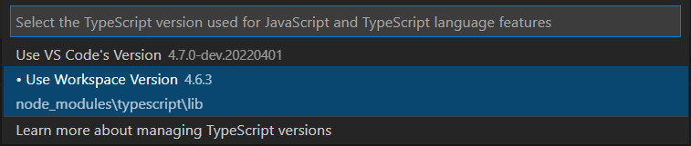

# ts-package-scope-plugin

TypeScript Language Service Plugin for creating package scopes using dir names and JSDocs.

It provides IntelliSense for VS Code and error reporting using TypeScript TSServer.

## Installation and usage

Install package:

`yarn add -D ts-package-scope-plugin` or `npm i --save-dev ts-package-scope-plugin`

Update `tsconfig..json`:

```json
{
    "compilerOptions": {
        "plugins": [{
            "name": "ts-package-scope-plugin"
        }]
    }
}
```

*VS Code users*

Run command *TypeScript: Select TypeScript version* and choose *Use workspace version*:



## Configuration

To make file package scoped it needs to be placed in folder with `package` in its name separated with dot ex. `package.<name>` or `<name>.package`:

```
project
│   README.md
│   file001.txt    
│
└───package.interface
│   │   api.ts
│   
└───package.domain
    │   client.ts
```

When you import file from one package into another, IDE will show a TypeScript error.

#### Public scope

To make file available from other packages set its scope to public using `/** package public **/` JS Doc at the top of the file:
```javascript
/** package public **/
import {Helper} from './helpers'

export function getClient() {

}
```

#### IntelliSense filtering (only for VS Code)

By default, files which are not available for current package will be removed from intellisense suggestions.
To turn on or off this feature you can use `intelliSense` option in tsconfig.json:

```json
{
  "compilerOptions": {
    "plugins": [{
      "name": "ts-package-scope-plugin",
      "options": {
        "intelliSense": false
      }
    }]
  }
}
```

